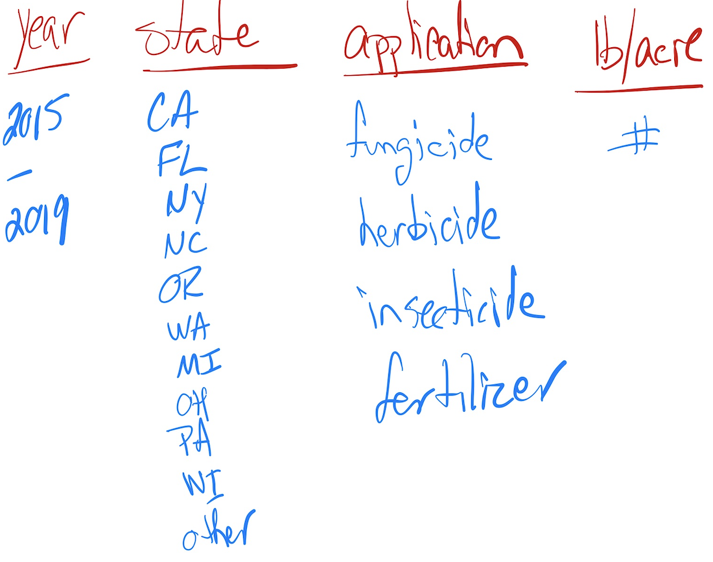

```{r setup, include=FALSE, warning=FALSE, message=FALSE}
knitr::opts_chunk$set(echo = FALSE)
library(knitr)
library(tidyverse)
library(magrittr)
library(kableExtra)
library(dplyr)
```

## My Goal



## My Workflow
1. Read and examine
2. Remove NA columns
3. Remove cols with no new info
4. Filter in 'Strawberries' & 'Year'
5. Filter out unnecessary from "Domain" column
6. Filter in useful from "Data Items" column
7. Create an "Applications" column

## 1. Read and examine
These data were collected from the USDA database selector: <a href="https://quickstats.nass.usda.gov">https://quickstats.nass.usda.gov</a>

The data were <a href="https://quickstats.nass.usda.gov/results/D416E96E-3D5C-324C-9334-1D38DF88FFF1">stored online</a> and then downloaded to a CSV file.

<u>The data has 21 columns.</u>
```{r echo=FALSE, message=FALSE, size='tiny'}
ag_data <- read_csv("berries.csv", col_names = TRUE)
colnames(ag_data)
#ugh - this is too wide - I don't know how to make it slimmer
```


## 2. Remove NA columns
I removed all the columns that only had NAs in them.
```{r echo=TRUE}

NA_cols <- which(sapply(ag_data, function(x)all(is.na(x))))

ag_data %<>% select(-all_of(NA_cols))
```


<u>I had these 12 columns.</u>
```{r}
colnames(ag_data)
```

## 3. Remove  cols with no new info
"Program" and "Geo Level" have only 1 value.  
"State ANSI" adds no new information to "State"
```{r echo=TRUE}

uni_cols <- sapply(ag_data,function(x) length(unique(x)))
ag_data %<>% subset(select=uni_cols>1)

ag_data %<>% select(-`State ANSI`)
```

<u>This leaves 8 columns.</u>
```{r}
colnames(ag_data)
```

## 4. Filter in 'Strawberries' and 'Year'
"PERIOD" col has 3 values: <br>
  'MARKETING YEAR', 'YEAR', and 'YEAR - AUG FORECAST'.<br>
I kept "PERIOD" = 'YEAR' for a consistent comparison.<br>  
After filtering, I removed the "Period" and "Commodity" columns.
```{r echo=TRUE}
straw <- ag_data %>% filter((Commodity=="STRAWBERRIES") & 
                              (Period=="YEAR"))
straw %<>% select(-c(Period, Commodity))
```

<u>This leaves 6 columns.</u>
```{r}
colnames(straw)
```

## 5. Filter out from "Domain" column
In the "Domain" column these are the unique entries:
```{r echo=TRUE}
straw$'Domain' %>% unique
```


I wanted to remove all the 'TOTAL' records.<br>
But first I needed to see what information was in those records.

## 
```{r echo=TRUE}
d_total <- filter(straw, Domain=="TOTAL")
d_total$`Data Item` %>% unique()
```
```{r}
d_total$`Domain Category` %>% unique()
```
##
None of these entries referred to chemical applications.  So I was comfortable removing those records.
```{r echo=TRUE}
straw <- filter(straw, Domain!="TOTAL")
```
<br>
<br>
This brought the data.frame down from <u>3,220 rows to 2,862 rows.</u>
  
## 6. Filter in from "Data Items" column
In this column there were 5 unique entries
```{r echo=TRUE}
straw$'Data Item' %>% unique
```
## 
I made a table to see which of these categories had the most information for me to use.
```{r echo=FALSE}
what <- data.frame(table(straw$'Data Item'))
kable(head(what, n=5)) %>% kable_styling(font_size=8)
```

<br>
Since the frequencies were almost identical, I used:<br><br>
"LB/ACRE/YEAR, AVG."

## 
I then filtered in these rows and deleted the "Data Item" column, and renamed the "Value" column to be "Avg lb/acre/yr."  
```{r echo=TRUE}
target<-"STRAWBERRIES, BEARING - APPLICATIONS, MEASURED IN LB / ACRE / YEAR, AVG"
straw %<>% filter(straw$'Data Item'==target) %<>%
  select(-('Data Item')) 
colnames(straw)[5] <-"Avg lb/acre/yr"
```
<u>The data.frame so far:</u>
```{r echo=FALSE}
kable(head(straw, n=4)) %>% kable_styling(font_size=10) %>% 
  column_spec(4, width="15em")
```

## 7. Create an "Application" column.
I separated the "Domain" column and kept just the back end of each of the entries.<br>
I relabeled this column "Application."
```{r echo=TRUE, warning=FALSE}
straw %<>% separate(Domain, c("D_left", "D_right"), sep = ", ") %>% 
  select(-('D_left'))
colnames(straw)[3] <-"Application"
```
<br>
<br>
This gave  the following unique entries in "Application":
```{r echo=FALSE}
straw$'Application' %>% unique
```
## 
<p style="font-size:18px">
Then I needed to see if all of the NAs in the "Application" column were when a 'FERTILIZER' was used.<br>  
To do this I wrote a loop that checked each row to see if, when the entry in "Application" was = NA, the "Domain Category" contained 'FERTILIZER.'<br><br>
</p>
```{r echo=TRUE}
n<-length(straw$Application)
x<-0
for (i in (1:n)) {
  one <- straw$Application[i]=="NA"
  two <- is.na(straw$Application[i])
  three <-  (str_detect(straw$`Domain Category`[i], "FERTILIZER"))
  if (one | two & three) {
    x <- x+1
  }
}
print(x)
```
## 
<p style="font-size:18px">I concluded that I could replace the NAs in the "Application" column with "FERTILIZER" and delete the "Domain Category" column.</p>

```{r echo=TRUE}
straw %<>% select(-("Domain Category")) 
straw$Application <- factor(straw$Application)
#revalue(straw$Application, c("FUNGICIDE"="Fungicide", "HERBICIDE"="Herbicide",
#                             "INSECTICIDE"="Insecticide", "OTHER"="Fertilizer"))
#This was my first attempt, but I couldn't figure out how to get it to NOT print out
#all 560 straw$Application entries when it ran.  So I did the following:

levels(straw$Application)[levels(straw$Application)=="OTHER"]<-"FERTILIZER"
```
<p style="font-size:18px">Finally, I filtered out  records where "Application" contained 'OTHER,' <br>
and where "Avg lb/acre/yr" contained (NA) or (D).</p>
```{r echo=TRUE}
straw %<>% filter(Application != "OTHER")
straw %<>% filter(straw$"Avg lb/acre/yr" != "(D)")
straw %<>% filter(straw$"Avg lb/acre/yr" != "(NA)")
```

<u>This got me down to 225 records.</u>

## MY FINAL PRODUCT
(n=225)

```{r echo=FALSE}
kable(head(straw, n=8)) %>% kable_styling(font_size=12)
```
