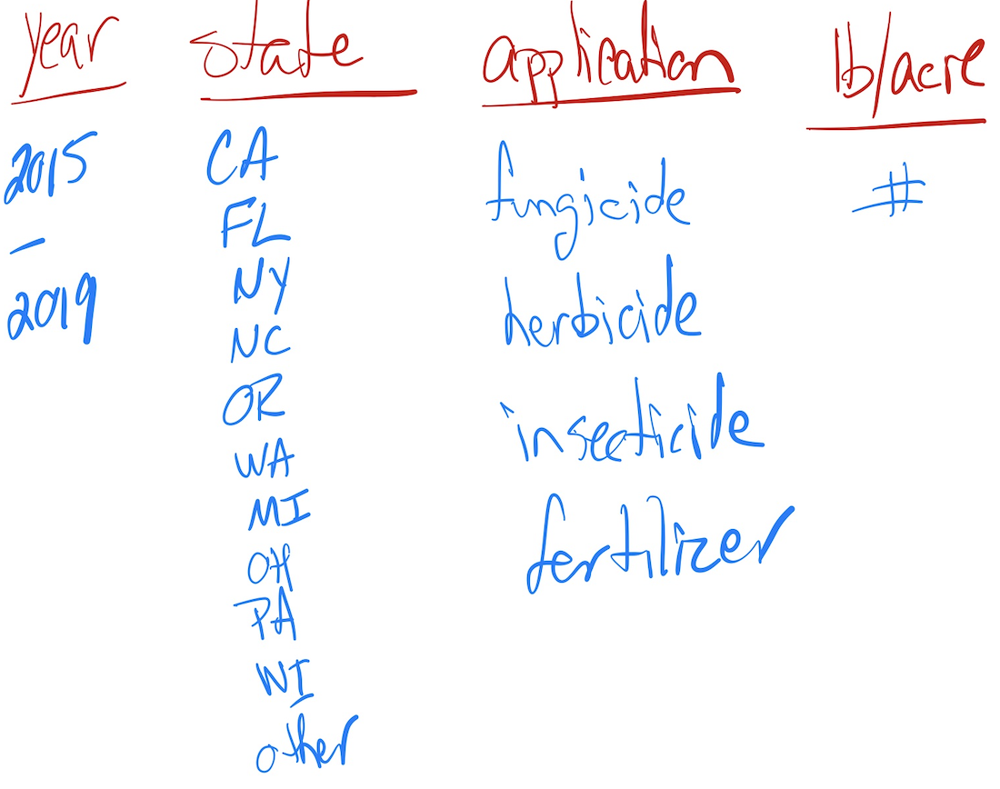

```{r setup, include=FALSE, warning=FALSE, message=FALSE}
library(knitr)
library(tidyverse)
library(magrittr)
library(kableExtra)

opts_chunk$set(echo = FALSE, 
               warning = FALSE,
               message = FALSE)
```
# My Goal
My overall goal is to create a data.frame that will allow me to look at the type of chemical application (fungicide, herbicide, insecticide, or fertilizer) and examine per acre applications in selected states during selected years.



# MY STEPS

##  (1) Read and examine

These data were collected from the USDA database selector: <a href="https://quickstats.nass.usda.gov">https://quickstats.nass.usda.gov</a>

The data were <a href="https://quickstats.nass.usda.gov/results/D416E96E-3D5C-324C-9334-1D38DF88FFF1">stored online</a> and then downloaded as a CSV file.

The data has 21 columns.

```{r echo=FALSE}
ag_data <- read_csv("berries.csv", col_names = TRUE)

colnames(ag_data)
```

## (2) Remove the columns that only had NAs
This leaves 12 columns.
```{r echo=FALSE}

NA_cols <- which(sapply(ag_data, function(x)all(is.na(x))))

ag_data %<>% select(-all_of(NA_cols))

colnames(ag_data)
```

## (3) Remove the columns that provide no new information
"Program" and "Geo Level" have only 1 value.  And "State ANSI" is a duplicate of "State"

This leaves 8 columns.
```{r echo=FALSE}

uni_cols <- sapply(ag_data,function(x) length(unique(x)))
ag_data %<>% subset(select=uni_cols>1)
#note - I could have done this at the beginning to also get rid of the NAs and 
#skipped the previous chunk of r code.  But I wanted to play with removing NAs.

ag_data %<>% select(-`State ANSI`) 

colnames(ag_data)
```

## (4) Select the rows that contain "Strawberries" & only the rows where the 'Period' = "YEAR".  Then eliminate the Period and Commodity column.
NOTE: The Period column has three values: "MARKETING YEAR", "YEAR", and "YEAR - AUG FORECAST."  I am only keeping the records where Period = "YEAR" so that we have a consistent comparison.

This leaves 6 columns.
```{r echo=FALSE}
straw <- ag_data %>% filter((Commodity=="STRAWBERRIES") & (Period=="YEAR"))
straw %<>% select(-c(Period, Commodity))

colnames(straw)
```

## (5) From the "Domain" column filter out unecessary records
### In "Domain" colunn there are the followng unique enteries:
```{r echo=FALSE}
straw$'Domain' %>% unique
```
### Before filtering out all the records where Domain=="TOTAL" I checked to see what information was in those records in the "Data Item" column and in the "Domain Category" column.
```{r}
 d_total <- filter(straw, Domain=="TOTAL")
d_total$`Data Item` %>% unique()
d_total$`Domain Category` %>% unique()

```
### None of these enteries refered to chemical applications.  So I was comfortable removing those records.  This brought the data.frame down from 3220 rows to # rows

